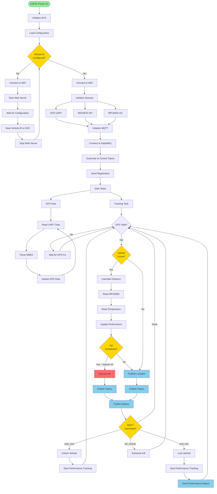
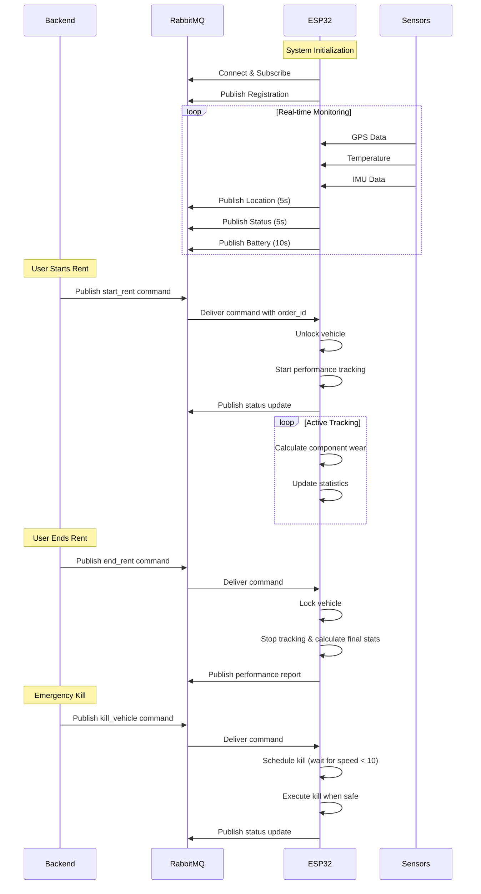
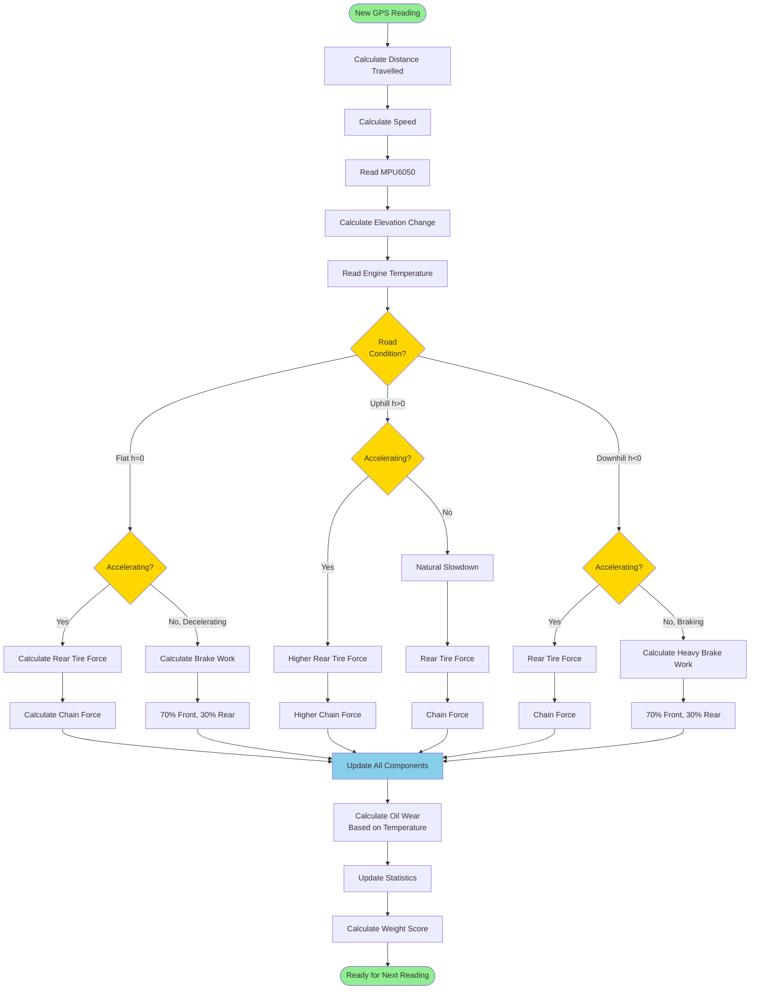

# System Flow Diagram

```mermaid
flowchart TD
    Start([ESP32 Power On]) --> InitNVS[Initialize NVS]
    InitNVS --> InitConfig[Load Configuration]
    InitConfig --> CheckConfig{Vehicle ID<br/>Configured?}
    
    CheckConfig -->|No| ConnectWiFi1[Connect to WiFi]
    ConnectWiFi1 --> StartWebServer[Start Web Server]
    StartWebServer --> WaitConfig[Wait for Configuration]
    WaitConfig --> SaveConfig[Save Vehicle ID to NVS]
    SaveConfig --> StopWebServer[Stop Web Server]
    StopWebServer --> CheckConfig
    
    CheckConfig -->|Yes| ConnectWiFi2[Connect to WiFi]
    ConnectWiFi2 --> InitSensors[Initialize Sensors]
    
    InitSensors --> InitGPS[GPS UART]
    InitSensors --> InitTemp[MAX6675 SPI]
    InitSensors --> InitIMU[MPU6050 I2C]
    
    InitGPS --> InitMQTT[Initialize MQTT]
    InitTemp --> InitMQTT
    InitIMU --> InitMQTT
    
    InitMQTT --> ConnectBroker[Connect to RabbitMQ]
    ConnectBroker --> Subscribe[Subscribe to Control Topics]
    Subscribe --> SendRegistration[Send Registration]
    SendRegistration --> StartTasks[Start Tasks]
    
    StartTasks --> GPSTask[GPS Task]
    StartTasks --> TrackingTask[Tracking Task]
    
    %% GPS Task Loop
    GPSTask --> ReadGPS[Read UART Data]
    ReadGPS --> ParseNMEA[Parse NMEA]
    ParseNMEA --> UpdateGPS[Update GPS Data]
    UpdateGPS --> ReadGPS
    
    %% Main Tracking Loop
    TrackingTask --> CheckGPS{GPS Valid?}
    
    CheckGPS -->|No| WaitGPS[Wait for GPS Fix]
    WaitGPS --> CheckGPS
    
    CheckGPS -->|Yes| CheckActive{Vehicle<br/>Active?}
    
    CheckActive -->|Yes| CalcDistance[Calculate Distance]
    CalcDistance --> ReadIMU[Read MPU6050]
    ReadIMU --> ReadTemp1[Read Temperature]
    ReadTemp1 --> UpdatePerf[Update Performance]
    UpdatePerf --> CheckKill{Kill<br/>Scheduled?}
    
    CheckKill -->|Yes + Speed<10| KillVehicle[Execute Kill]
    KillVehicle --> PublishStatus1[Publish Status]
    
    CheckKill -->|No| PublishLocation[Publish Location]
    
    CheckActive -->|No| PublishLocation
    PublishLocation --> PublishStatus2[Publish Status]
    PublishStatus1 --> PublishBattery[Publish Battery]
    PublishStatus2 --> PublishBattery
    
    PublishBattery --> ListenCommand{MQTT<br/>Command?}
    
    %% Command Handling
    ListenCommand -->|start_rent| UnlockVehicle[Unlock Vehicle]
    UnlockVehicle --> StartTracking[Start Performance Tracking]
    StartTracking --> CheckGPS
    
    ListenCommand -->|end_rent| LockVehicle[Lock Vehicle]
    LockVehicle --> StopTracking[Stop Performance Tracking]
    StopTracking --> SendReport[Send Performance Report]
    SendReport --> CheckGPS
    
    ListenCommand -->|kill_vehicle| ScheduleKill[Schedule Kill]
    ScheduleKill --> CheckGPS
    
    ListenCommand -->|None| CheckGPS
    
    style Start fill:#90EE90
    style CheckConfig fill:#FFD700
    style CheckActive fill:#FFD700
    style CheckKill fill:#FFD700
    style ListenCommand fill:#FFD700
    style PublishLocation fill:#87CEEB
    style PublishStatus1 fill:#87CEEB
    style PublishStatus2 fill:#87CEEB
    style PublishBattery fill:#87CEEB
    style SendReport fill:#87CEEB
    style KillVehicle fill:#FF6B6B
```

## MQTT Command Flow

```mermaid
sequenceDiagram
    participant Backend
    participant RabbitMQ
    participant ESP32
    participant Sensors
    
    Note over ESP32: System Initialization
    ESP32->>RabbitMQ: Connect & Subscribe
    ESP32->>RabbitMQ: Publish Registration
    
    loop Real-time Monitoring
        Sensors->>ESP32: GPS Data
        Sensors->>ESP32: Temperature
        Sensors->>ESP32: IMU Data
        ESP32->>RabbitMQ: Publish Location (5s)
        ESP32->>RabbitMQ: Publish Status (5s)
        ESP32->>RabbitMQ: Publish Battery (10s)
    end
    
    Note over Backend: User Starts Rent
    Backend->>RabbitMQ: Publish start_rent command
    RabbitMQ->>ESP32: Deliver command with order_id
    ESP32->>ESP32: Unlock vehicle
    ESP32->>ESP32: Start performance tracking
    ESP32->>RabbitMQ: Publish status update
    
    loop Active Tracking
        ESP32->>ESP32: Calculate component wear
        ESP32->>ESP32: Update statistics
    end
    
    Note over Backend: User Ends Rent
    Backend->>RabbitMQ: Publish end_rent command
    RabbitMQ->>ESP32: Deliver command
    ESP32->>ESP32: Lock vehicle
    ESP32->>ESP32: Stop tracking & calculate final stats
    ESP32->>RabbitMQ: Publish performance report
    
    Note over Backend: Emergency Kill
    Backend->>RabbitMQ: Publish kill_vehicle command
    RabbitMQ->>ESP32: Deliver command
    ESP32->>ESP32: Schedule kill (wait for speed < 10)
    ESP32->>ESP32: Execute kill when safe
    ESP32->>RabbitMQ: Publish status update
```

## Performance Calculation Flow

```mermaid
flowchart TD
    Start([New GPS Reading]) --> CalcDist[Calculate Distance Travelled]
    CalcDist --> CalcSpeed[Calculate Speed]
    CalcSpeed --> ReadIMU[Read MPU6050]
    ReadIMU --> CalcElev[Calculate Elevation Change]
    CalcElev --> ReadTemp[Read Engine Temperature]
    
    ReadTemp --> CheckCondition{Road<br/>Condition?}
    
    CheckCondition -->|Flat h=0| CheckAccel1{Accelerating?}
    CheckAccel1 -->|Yes| RearForce1[Calculate Rear Tire Force]
    RearForce1 --> ChainForce1[Calculate Chain Force]
    ChainForce1 --> UpdateComponents
    
    CheckAccel1 -->|No, Decelerating| BrakeCalc1[Calculate Brake Work]
    BrakeCalc1 --> DistributeBrake1[70% Front, 30% Rear]
    DistributeBrake1 --> UpdateComponents
    
    CheckCondition -->|Uphill h>0| CheckAccel2{Accelerating?}
    CheckAccel2 -->|Yes| RearForce2[Higher Rear Tire Force]
    RearForce2 --> ChainForce2[Higher Chain Force]
    ChainForce2 --> UpdateComponents
    
    CheckAccel2 -->|No| NaturalSlow[Natural Slowdown]
    NaturalSlow --> RearForce3[Rear Tire Force]
    RearForce3 --> ChainForce3[Chain Force]
    ChainForce3 --> UpdateComponents
    
    CheckCondition -->|Downhill h<0| CheckAccel3{Accelerating?}
    CheckAccel3 -->|Yes| RearForce4[Rear Tire Force]
    RearForce4 --> ChainForce4[Chain Force]
    ChainForce4 --> UpdateComponents
    
    CheckAccel3 -->|No, Braking| BrakeCalc2[Calculate Heavy Brake Work]
    BrakeCalc2 --> DistributeBrake2[70% Front, 30% Rear]
    DistributeBrake2 --> UpdateComponents
    
    UpdateComponents[Update All Components] --> CalcOil[Calculate Oil Wear<br/>Based on Temperature]
    CalcOil --> UpdateStats[Update Statistics]
    UpdateStats --> CalcWeight[Calculate Weight Score]
    CalcWeight --> End([Ready for Next Reading])
    
    style Start fill:#90EE90
    style CheckCondition fill:#FFD700
    style CheckAccel1 fill:#FFD700
    style CheckAccel2 fill:#FFD700
    style CheckAccel3 fill:#FFD700
    style UpdateComponents fill:#87CEEB
    style End fill:#90EE90
```